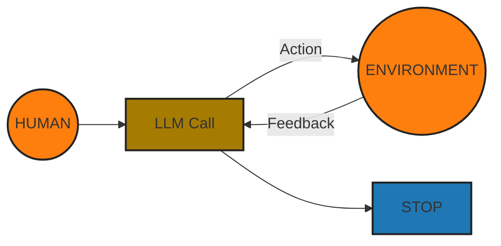

# Agent vs Workflow Patterns in LLM Design Applications

Agents:
 - Open-ended
 - Feedback loops
 - No fidex paths
  

## Risk of Agent Frameworks

- Unpredictable path
- Unpredictable output
- Unpredictable costs

## Mitigate risks:

- Monitor
- Guardrails to ensure your agents behave safely, consistenly, and within your intended boundaries