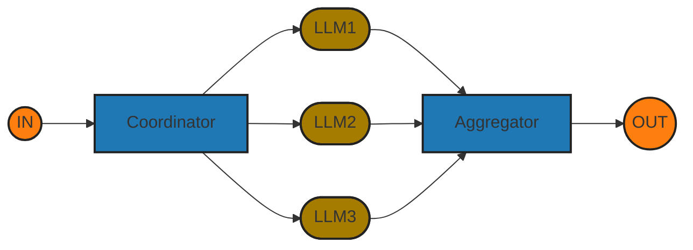

# 5 Workflow design patterns

## Prompt Chaining

Decomposit into fixed subtasks

## Routing

Direct an input into a specialized subtask, ensuring separation of concerns.

## Parallelization

Braking down tasks and running  multiple subtasks concurrently.

## Orchestrator Worker

Complex tasks are broken down dynamically and combined

## Evaluation Optimizer

LLM output is validated by another

