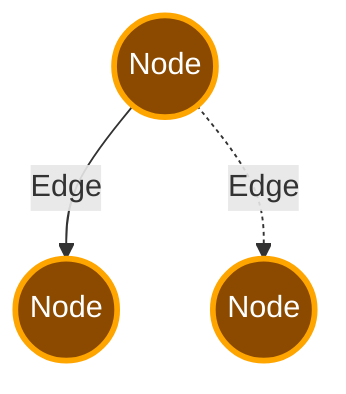

# LangGraph

## Termilogy

Agent workflows are represented by graphs.

**_State_** represents the current snapshot of the application.

**_Nodes_** are python functions that represent agent logic. They receive the current state as input, do something, and return an update state.

**_Edges_** are python functions that determine which node to execute next based on the State. They can be conditional or fixed.

Nodes do the work and Edges choose what to do next.

