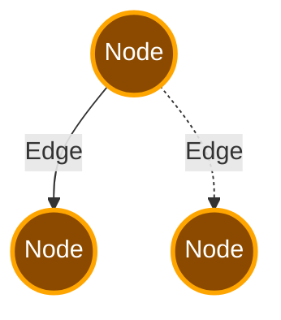

# LangGraph

## Termilogy

Agent workflows are represented by graphs.

**_State_** represents the current snapshot of the application.

 - Is immutable.
 - For each field in State, you can specify a special function called reducer.
 - When you return a new state, LangGraph uses the reducer to combine this field with existing state.
 - This enables LangGraph to run multiple nodes concurrently and combines State without overwriting.

**_Nodes_** are python functions that represent agent logic. They receive the current state as input, do something, and return an update state.

**_Edges_** are python functions that determine which node to execute next based on the State. They can be conditional or fixed.

Nodes do the work and Edges choose what to do next.

## Super Steps

A super step can be considered a single iteration over the graph nodes. Nodes that run in parallel are parte of the same super step, while nodes that run sequentially are not.

The graph describes one super step; one iteraction between agents and tools to achieve an outcome.

Every user interaction is a fresh graph.invoke(sate) call

The reducer handles updating state during a super step but not between super steps.