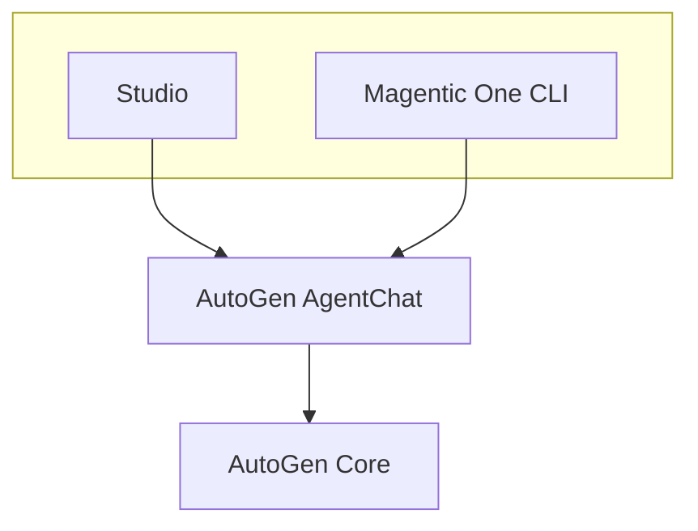

# Autogen

Note: VS Code's built-in Markdown preview doesn't render Mermaid diagrams by default. Install an extension such as "Markdown Preview Enhanced" or "Markdown Preview Mermaid Support", then open the Markdown preview (e.g. `Ctrl+K V`) to view the diagram.

## AutoGen Core

Event-Drver framework for scalable multi agent AI system

## AutoGen AgentChat

Conversational Single and Multi Agent application

## Studio 

Low code / no code app

## Magnetic One CLI

A console based assistent

